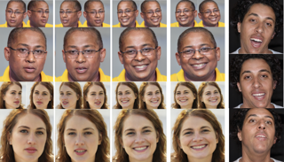
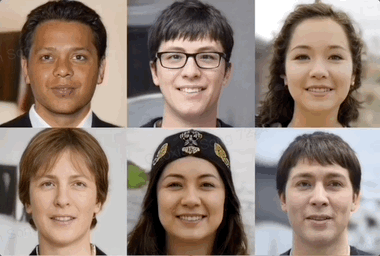
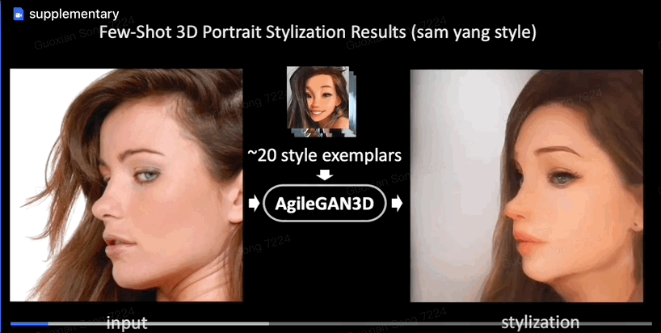

<table class="imgtable"><tr>
<td>&nbsp;</td>
<td align="left">
<strong><a href="https://hongyixu37.github.io/omniavatar/">OmniAvatar: Geometry-Guided Controllable 3D Head Synthesis</a></strong> 
    <strong>Hongyi Xu</strong>,  Guoxian Song, Zihang Jiang, Jianfeng Zhang, Yichun Shi, Jing Liu, Wanchun Ma, Jiashi Feng, Linjie Luo. 
    Computer Vision and Pattern Recognition (CVPR) 2023. 
</td>
</tr><tr>
<td>&nbsp;</td>
<td align="left">
<strong><a href="https://sizhean.github.io/panohead">PanoHead: Geometry-Aware 3D Full-Head Synthesis in 360°</a></strong> 
    Sizhe An, <strong>Hongyi Xu</strong>, Yichun Shi, Guoxian Song, Umit Y. Ogras, Linjie Luo. 
    Computer Vision and Pattern Recognition (CVPR) 2023. 
</td>
</tr><tr>
<td>&nbsp;</td>
<td align="left">
<strong>AgileGAN3D: Few-Shot 3D Portrait Stylization by Augmented Transfer Learning</strong> 
    Guoxian Song, <strong>Hongyi Xu</strong>, Jing Liu, Tiancheng Zhi, Yichun Shi, Jianfeng Zhang, Zihang Jiang, Jiashi Feng, Shen Sang, Linjie Luo. 
    Computer Vision and Pattern Recognition (CVPR) 2023. 
</td>
</table>
 

           <table class="imgtable"><tr><td>
            &nbsp;</td>
            <td align="left">
 
                 <strong> Guoxian Song</strong>, Hongyi Xu, Jing Liu, Tiancheng Zhi, Yichun Shi, Jianfeng Zhang, Zihang Jiang, Jiashi Feng, Shen Sang, Linjie Luo. 
                 Tech Report 2023. 
            [paper]  

            </td></tr></table>
             

   

